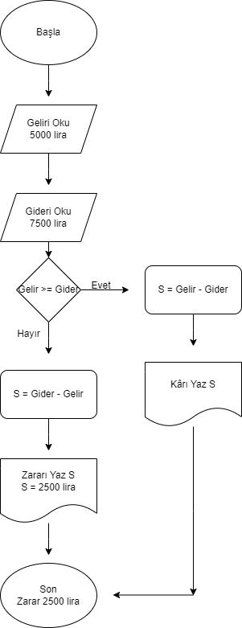
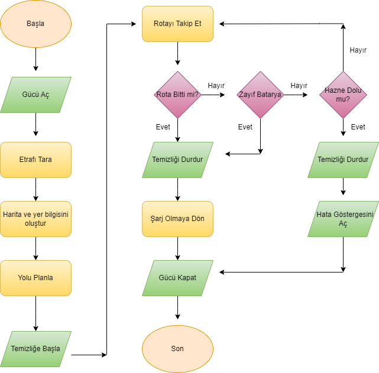
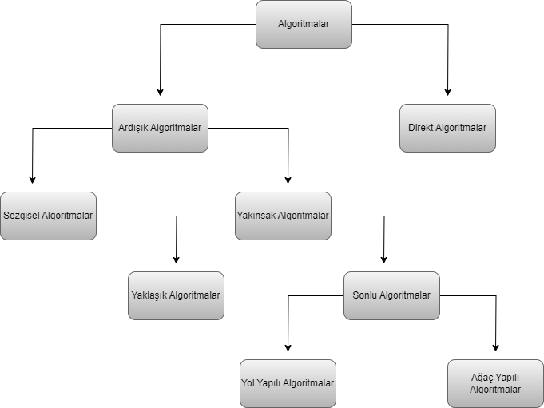

# algorithm-exercises

## Algoritma nedir?

> Algoritma bir problemin çözümü için uygulanması ya da takip edilmesi gereken **yönergelerin bütünü** olarak ifade edilebilir.

> Teknik açıdan bakıldığında ilgili problemin çözümü için kullanılacak **komut dizisi** de algoritma olarak tanımlanabilir.

> Algoritmalar bir probleme karşı sunulan çözüm yolunun adım adım anlatılmasını ve programın karşılaştığı farklı durumlar karşısında kararsız kalmadan sonuca **en kısa yoldan** ve **en az maliyetle** gitmesini amaç edinmektedir.

## Algoritma Özellikleri

> - Her algoritmanın başlangıç ve bitiş noktası vardır. Sonlu adımlar arasında tanımlanırlar. Kimi algoritmalar problemi n adımda çözerken kimi algoritmalar n<sup>2</sup> adımda çözer.

> - Hesaplamalar, veri işleme, otomatik akıl yürütme ve diğer görevleri gerçekleştirmek için algoritmalar özel olarak tanımlanmış **sistematik adımları** içerir.

✨ *Etkili bir algoritma, mevcut **donanım kaynaklarını** dikkate alarak, **sınırlı bir alan** ve **zaman** içinde tanımlı problem için bir çözüm üretebilmelidir.*

> - Algoritmaların verimli bir şekilde çalışması için çoğu zaman **başlangıç koşulları ve ilk girişlerin değerleri** belirtilir.

> - Algoritma içeriğinde aritmetik ve mantıksal adımlar bulundurabilir. Matematiksel açıdan, algoritmalara bir prosedür ya da fonksiyon gözü ile bakılabilir.

## Akış Şeması

Algoritmaların anlaşılmalarını kolaylaştırmak üzere bir takım bloklar kullanılmaktadır. Bu bloklar bütününe akış şeması denilmektedir.


*<span style="color: gray">Şema-1</span>*

*Şema-1 drawio ile çizilmiştir.*

Örnek bir akış şeması inceleyelim.


*<span style="color: gray">Şema-2</span>*

*Şema-2 Örnek akış şeması görseli wikipedia'dan alınmıştır.*

İki sayının toplanmasını içeren bir algoritma şeması hazırlayalım.


*<span style="color: gray">Şema-3</span>*

*Şema-3 drawio ile çizilmiştir.*

Aylık geliri 5000 lira, aylık gideri 7500 lira olan bir kişinin aylık kâr zarar algoritma şemasını hazırlayalım.



*<span style="color: gray">Şema-4</span>*

*Şema-4 drawio ile çizilmiştir.*

Bir temizlik robotunun akış şemasını hazırlayalım.



*<span style="color: gray">Şema-5</span>*

*Şema-5 drawio ile çizilmiştir.*


## Kaba Kod (Pseudo Code)

- Programcılar sıklıkla algoritmaları, **yalnızca insan gözlerine yönelik bir şekilde** tanımlamak isterler.

- Bu tanımlamalar **bilgisayar programı ya da bir akış şeması** değildir. Daha çok **yapılandırılmış bir metin tanımıdır.**

- Bu tanımlamalar veri yapısının ya da algoritmanın **üst düzey analizini** kolaylaştırır.

- Bir kaba kod yazarken bu kodun **makinelerin değil**, insanların okuyacağı unutulmamalıdır.

- **Anlaşılırlık yüksek seviyede tutulmalı**, teknik detaylardan kaçınılmalıdır.

Bir örnekle kaba kodu pekiştirelim.

1'den n'e kadar olan sayıları ekrana yazdıran algoritmanın kaba kodlarını yazalım.

```
Algoritma ekranaYaz(n)
Giriş: Limit değerini temsil eden n sayısı
Çıkış: Değer yok
n değerini oku
i = 0
Koşul belirle i <= n
i ekrana yaz
i'nin değerini 1 arttır
...
ekranaYaz(5)
Başla
i = 0
i <= 5 evet
0

i = 1
i <= 5 evet
1

i = 2
i <= 5 evet
2

i = 3
i <= 5 evet
3

i = 4
i <= 5 evet
4

i = 5
i <= 5 evet
5

i = 6
i <= 5 hayır
5
Son
```

## Algoritmanın Morfolojisi

- Bir değişken bilgisayar hafızasında bir değeri depolamak ve ihtiyaç halinde okumak üzere ayrılmış olan belirli bir yeri ya da alanı işaret eder.

- Bir değişkenin veri türü değişkenin alabileceği, sınırları belirli ve değişken türüne bağlı olarak kendisi için ayrılmış olan alanı gösterir.

- Bir ifade veya bir kod satırı algoritmada izlenecek tek bir adımı tanımlamak üzere kullanılır.

Bir algoritmada temelde üç blok halinde düşünülebilir. **Giriş**, **işleme**, **çıkış** şeklinde özetlenebilir.

- Giriş seti içerisindeki veriler bir ses kaydı, bir imge, bir metin ya da benzer bir ifade olabilir.

- İşleme blogu algoritmaya ait tanımlı prosedürlerin ardışık bir şekilde işlenmesini sağlar.

- Çıkış seti ise verilen girdiye bağlı olarak üretilen çıktıyı temsil eder.

Bir problemin çözümünü sağlamak üzere algoritmanın işlem bileşenleri:

- Atama ifadeleri
- Aritmetik işlemler
- Mantıksal ifadeler
- Döngüler
- Veri yapıları ve organizasyonu
- Yazma ve okuma prosedürleri

## Algoritma Türleri

- Algoritma prosedürleri işletme şekillerine göre kategorilere ayrılabilirler.

- Bu farklı kategoriler algoritmaların çalışma şekillerine ve yapılarına yansımaktadır.



*<span style="color: gray">Şema-6</span>*

*Şema-6 drawio ile çizilmiştir.*

- Direkt Algoritmalar

Algoritmaların en temel çalışma bileşenlerinden biri iterasyonlardır. İterasyon, belirli koşullar altında kendini tekrar eden kod blokları olarak ifade edilebilir. İterasyonlarla **çalışmayan** algoritmalar direkt algoritmalar olarak isimlendirilir. Örn: ikinci dereceden denklem çözümleri

- Ardışık Algoritmalar

Direkt algoritmaların aksine amaçlanan problemin çözümünü yerine getirmek üzere pek çok algoritma ardışık olarak çalışır ve bu algoritmalar ardışık algoritmalar olarak adlandırılır. Örn: faktöriyel hesapları

- Yakınsak Algoritmalar

Aranılan çözüme doğru yakınsayan ardışık algoritmalardır. Bazı yakınsak algoritmalar kesin çözümü elde edemezler fakat bu çözüme yaklaşık bir değeri kesin çözüm alırlar. Yaklaşık algoritmalar sonlu değillerdir; fakat her bir ileri iterasyon onları kesin çözüme biraz daha yaklaştırır. Yaklaşık algoritmalara değişken kesen metodu, arama teknikleri vb. örnekler verilebilir.

- Sonlu Algoritmalar

İterasyonların sonlu bir sayısında kesin çözümü garanti eden yakınsak algoritmalardır, yol yapılı ve ağaç yapılı olarak ikiye ayrılırlar. 

**Yol Yapılı** algoritmaların pek çoğu yol yapısına sahiptir. Bu yol yapısında bir iterasyon bir önceki iterasyonu iterasyon dizilerinde farklı dallar üretmeksizin takip eder.

**Ağaç Yapılı** algoritmalar diğer sonlu algoritmalarda iterasyon  dizileri, pek çok paralel dalları içeren bir ağaç şeklindedir. Birçok ağaç arama algoritmaları bu sınıfa aittir.
