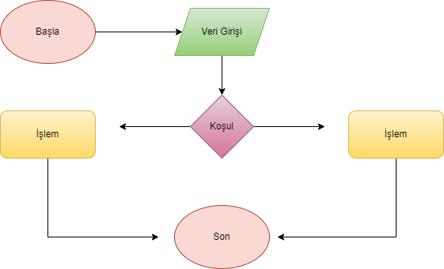
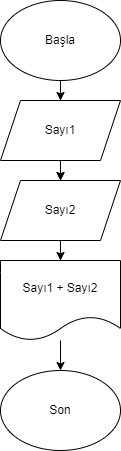

# algorithm-exercises

## Algoritma nedir?

> Algoritma bir problemin çözümü için uygulanması ya da takip edilmesi gereken **yönergelerin bütünü** olarak ifade edilebilir.

> Teknik açıdan bakıldığında ilgili problemin çözümü için kullanılacak **komut dizisi** de algoritma olarak tanımlanabilir.

> Algoritmalar bir probleme karşı sunulan çözüm yolunun adım adım anlatılmasını ve programın karşılaştığı farklı durumlar karşısında kararsız kalmadan sonuca **en kısa yoldan** ve **en az maliyetle** gitmesini amaç edinmektedir.

## Algoritma Özellikleri

> - Her algoritmanın başlangıç ve bitiş noktası vardır. Sonlu adımlar arasında tanımlanırlar. Kimi algoritmalar problemi n adımda çözerken kimi algoritmalar n2 adımda çözer.

> - Hesaplamalar, veri işleme, otomatik akıl yürütme ve diğer görevleri gerçekleştirmek için algoritmalar özel olarak tanımlanmış **sistematik adımları** içerir.

✨ *Etkili bir algoritma, mevcut **donanım kaynaklarını** dikkate alarak, **sınırlı bir alan** ve **zaman** içinde tanımlı problem için bir çözüm üretebilmelidir.*

> - Algoritmaların verimli bir şekilde çalışması için çoğu zaman **başlangıç koşulları ve ilk girişlerin değerleri** belirtilir.

> - Algoritma içeriğinde aritmetik ve mantıksal adımlar bulundurabilir. Matematiksel açıdan, algoritmalara bir prosedür ya da fonksiyon gözü ile bakılabilir.

## Akış Şeması

Algoritmaların anlaşılmalarını kolaylaştırmak üzere bir takım bloklar kullanılmaktadır. Bu bloklar bütününe akış şeması denilmektedir.

*Şema-1*

*Şema-1 drawio ile çizilmiştir.*

Örnek bir akış şeması inceleyelim.

*Şema-2*

*Şema-2 Örnek akış şeması görseli wikipedia'dan alınmıştır.*

İki sayının toplanmasını içeren bir algoritma şeması hazırlayalım.

*Şema-3*

*Şema-3 drawio ile çizilmiştir.*